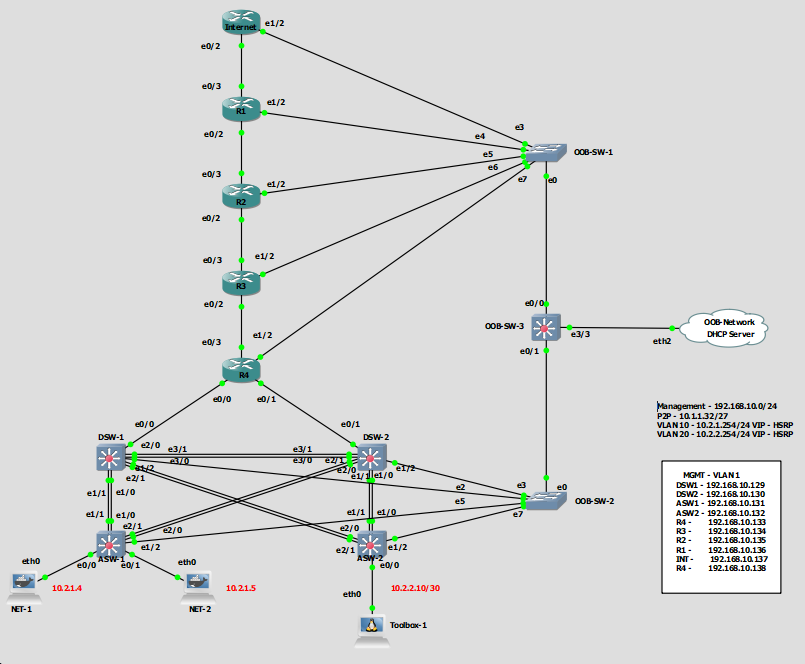

# CCNP-TSHOOT-GNS3
The idea of this project is to automate the deployment of the CCNP Tshoot lab. This is helpful for anyone interested in practicing over the exam topology.

## Usage

## Assignment 1 - Build Your Own Network Automation Lab  

### Selecting the Gear
I've used my home PC (Windows 10 - 32GB RAM - AMD FX(tm)-8350 (8 Cores)), you can always use an ESXI host, VMware Workstation or even Virtualbox which is free on AWS,GCP or a local PC/Server. There are many options to setup your lab.   
  
**Features:**  
* Windows 10 host with 32 GB of RAM.  
* Lab Platform: GNS3 (2.1.11) GUI + GNS3 VM(All the images and projects will be stored here).  
* Hypervisor: VMWare Workstation.  
* Guest VM (Control Machine): Ubuntu 16.04 Where all the Automation will be run from. This will be the machine I will use to reach teh devices in the GNS3 VM.  
* Guest VM (GNS3 VM): We will be using the GNS3 VM 2.1.11 in VMware Workstation.  
* GNS3 Images: Cisco IOU L3 15.2-2.15T (For routing) + Cisco IOU L2 15.2d (For switching). The only limitation is that they don't work quite well with SSH so I will be using Telnet to reach them.
  
### Building the lab
* For this lab I have created Virtual adapters on my guest VM (Ubuntu 16.04 - 8 GB RAMS) and the GNS3VM(8 GB RAM). Those adapters have been binded to a custom Network 192.168.10/24 (VMnet7 - Host Only). This way we'll be able to reach the devices from the Ubuntu box where I can have a massive range of Automation tools to play with.  
* DHCP: In the control machine I've used isc-dhcp to provide IPs to the network devices. Those IPs have manually assigned to each network device by staticly creating a reservation based on the device's MAC address.  
* MGMT Interfaces: All devices will be managed via the Ethernet 1/2 interface on Vlan 1.  

### Lab Topology

[Official Cisco Tshoot Exam Topology](https://learningnetwork.cisco.com/servlet/JiveServlet/download/52366-8599/TSHOOT%20Exam%20Topology.pdf)

